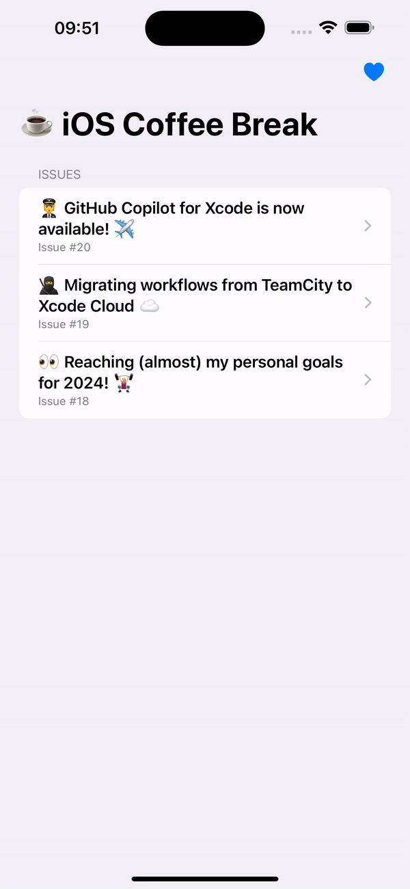

# SwiftUI Navigation using the Coordinator Pattern

Sample project for the article [Refactoring my SwiftUI Navigation Layer to follow the Coordinator Pattern 🔀](https://tiagohenriques.vercel.app/blog/swiftui-refactor-navigation-layer-using-coordinator-pattern), demonstrating how to create a scalable routing system in SwiftUI.
 

  

